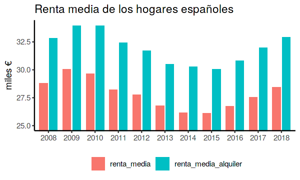
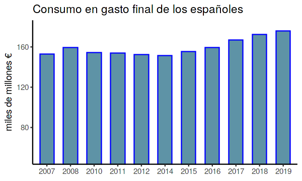
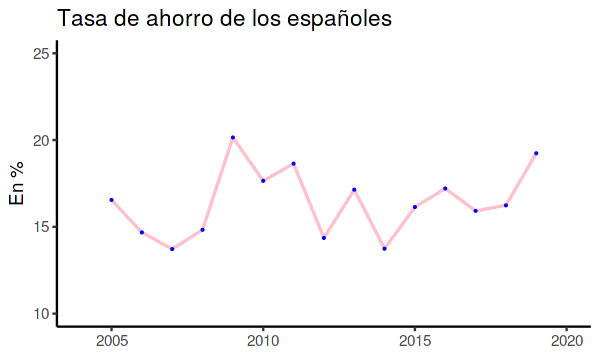
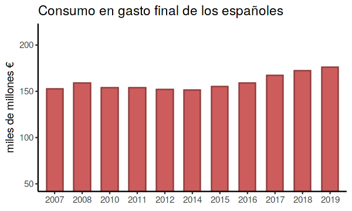

# INFORME ECONÓMICO DEL CONSUMO Y AHORRO DE LOS ESPAÑOLES

## En este informe económico analizamos el gasto de los españoles en los diferentes productos. Los datos se extraen de la [página web datos.gob.es](datos.gob.es) .<br><br>


```R
library(ggplot2)
```


```R
library(readr)
```


```R
library(dplyr)
library(tidyr)
```

    Warning message:
    “package ‘dplyr’ was built under R version 3.6.2”
    Attaching package: ‘dplyr’
    
    The following objects are masked from ‘package:stats’:
    
        filter, lag
    
    The following objects are masked from ‘package:base’:
    
        intersect, setdiff, setequal, union
    
    Warning message:
    “package ‘tidyr’ was built under R version 3.6.2”


```R
rmedia<-read.csv(file='renta_media_de_los_hogare.csv',sep=';') %>% top_n(11)
rmedia <- select(rmedia,-Periodo)
```

    Selecting by Renta.media.por.hogar..con.alquiler.imputado.


```R
options(repr.plot.width=5, repr.plot.height=3)
```


```R
rmedia<- rename(rmedia, renta_media='Renta.media.por.hogar')
rmedia<- rename(rmedia, renta_media_alquiler='Renta.media.por.hogar..con.alquiler.imputado.')
```


```R
rmedia
```


<table>
<caption>A data.frame: 11 × 3</caption>
<thead>
	<tr><th scope=col>Año</th><th scope=col>renta_media</th><th scope=col>renta_media_alquiler</th></tr>
	<tr><th scope=col>&lt;fct&gt;</th><th scope=col>&lt;dbl&gt;</th><th scope=col>&lt;dbl&gt;</th></tr>
</thead>
<tbody>
	<tr><td>2008</td><td>28.787</td><td>32.807</td></tr>
	<tr><td>2009</td><td>30.045</td><td>33.953</td></tr>
	<tr><td>2010</td><td>29.634</td><td>33.965</td></tr>
	<tr><td>2011</td><td>28.206</td><td>32.429</td></tr>
	<tr><td>2012</td><td>27.747</td><td>31.686</td></tr>
	<tr><td>2013</td><td>26.775</td><td>30.501</td></tr>
	<tr><td>2014</td><td>26.154</td><td>30.257</td></tr>
	<tr><td>2015</td><td>26.092</td><td>30.031</td></tr>
	<tr><td>2016</td><td>26.730</td><td>30.822</td></tr>
	<tr><td>2017</td><td>27.558</td><td>31.956</td></tr>
	<tr><td>2018</td><td>28.417</td><td>32.929</td></tr>
</tbody>
</table>


```R
dat<- rmedia %>% gather("Stat","Value", -Año)
dat
```


<table>
<caption>A data.frame: 22 × 3</caption>
<thead>
	<tr><th scope=col>Año</th><th scope=col>Stat</th><th scope=col>Value</th></tr>
	<tr><th scope=col>&lt;fct&gt;</th><th scope=col>&lt;chr&gt;</th><th scope=col>&lt;dbl&gt;</th></tr>
</thead>
<tbody>
	<tr><td>2008</td><td>renta_media         </td><td>28.787</td></tr>
	<tr><td>2009</td><td>renta_media         </td><td>30.045</td></tr>
	<tr><td>2010</td><td>renta_media         </td><td>29.634</td></tr>
	<tr><td>2011</td><td>renta_media         </td><td>28.206</td></tr>
	<tr><td>2012</td><td>renta_media         </td><td>27.747</td></tr>
	<tr><td>2013</td><td>renta_media         </td><td>26.775</td></tr>
	<tr><td>2014</td><td>renta_media         </td><td>26.154</td></tr>
	<tr><td>2015</td><td>renta_media         </td><td>26.092</td></tr>
	<tr><td>2016</td><td>renta_media         </td><td>26.730</td></tr>
	<tr><td>2017</td><td>renta_media         </td><td>27.558</td></tr>
	<tr><td>2018</td><td>renta_media         </td><td>28.417</td></tr>
	<tr><td>2008</td><td>renta_media_alquiler</td><td>32.807</td></tr>
	<tr><td>2009</td><td>renta_media_alquiler</td><td>33.953</td></tr>
	<tr><td>2010</td><td>renta_media_alquiler</td><td>33.965</td></tr>
	<tr><td>2011</td><td>renta_media_alquiler</td><td>32.429</td></tr>
	<tr><td>2012</td><td>renta_media_alquiler</td><td>31.686</td></tr>
	<tr><td>2013</td><td>renta_media_alquiler</td><td>30.501</td></tr>
	<tr><td>2014</td><td>renta_media_alquiler</td><td>30.257</td></tr>
	<tr><td>2015</td><td>renta_media_alquiler</td><td>30.031</td></tr>
	<tr><td>2016</td><td>renta_media_alquiler</td><td>30.822</td></tr>
	<tr><td>2017</td><td>renta_media_alquiler</td><td>31.956</td></tr>
	<tr><td>2018</td><td>renta_media_alquiler</td><td>32.929</td></tr>
</tbody>
</table>


```R
p1<- ggplot(data=dat, aes(x=Año,y=Value , fill=Stat)) 
p1<-p1 + geom_bar(stat="identity",position=position_dodge(width=.85),width=.7)
p1<-p1 + theme_classic() + labs(x = NULL, y="miles €",title="Renta media de los hogares españoles") 
p1<- p1 + coord_cartesian(ylim=c(25,34)) 
p1<- p1 + theme(legend.position="bottom",legend.title=element_blank())
p1
```





# Renta media de los españoles # 

La renta bruta disponible de los hogares, estas instituciones obtuvieron una renta disponible total de 218.205 millones de euros un 5,76% en tasa interanual


```R
consumo<-read.csv(file='evolucion_del_gasto_en_consumo.csv',sep=';') %>% top_n(11)
```

    Selecting by Gasto.en.consumo.final..en..millones.de.euros.


```R
consumo
```


<table>
<caption>A data.frame: 11 × 3</caption>
<thead>
	<tr><th scope=col>Año</th><th scope=col>Periodo</th><th scope=col>Gasto.en.consumo.final..en..millones.de.euros.</th></tr>
	<tr><th scope=col>&lt;fct&gt;</th><th scope=col>&lt;fct&gt;</th><th scope=col>&lt;dbl&gt;</th></tr>
</thead>
<tbody>
	<tr><td>2007</td><td>Trimestre 2</td><td>152.690</td></tr>
	<tr><td>2008</td><td>Trimestre 2</td><td>159.240</td></tr>
	<tr><td>2010</td><td>Trimestre 2</td><td>154.310</td></tr>
	<tr><td>2011</td><td>Trimestre 2</td><td>154.110</td></tr>
	<tr><td>2012</td><td>Trimestre 2</td><td>152.203</td></tr>
	<tr><td>2014</td><td>Trimestre 2</td><td>151.400</td></tr>
	<tr><td>2015</td><td>Trimestre 2</td><td>155.541</td></tr>
	<tr><td>2016</td><td>Trimestre 2</td><td>159.397</td></tr>
	<tr><td>2017</td><td>Trimestre 2</td><td>167.121</td></tr>
	<tr><td>2018</td><td>Trimestre 2</td><td>172.311</td></tr>
	<tr><td>2019</td><td>Trimestre 2</td><td>175.935</td></tr>
</tbody>
</table>


```R
consumo<- rename(consumo, gasto_consumo='Gasto.en.consumo.final..en..millones.de.euros.')
```


```R
consumo
```


<table>
<caption>A data.frame: 11 × 3</caption>
<thead>
	<tr><th scope=col>Año</th><th scope=col>Periodo</th><th scope=col>gasto_consumo</th></tr>
	<tr><th scope=col>&lt;fct&gt;</th><th scope=col>&lt;fct&gt;</th><th scope=col>&lt;dbl&gt;</th></tr>
</thead>
<tbody>
	<tr><td>2007</td><td>Trimestre 2</td><td>152.690</td></tr>
	<tr><td>2008</td><td>Trimestre 2</td><td>159.240</td></tr>
	<tr><td>2010</td><td>Trimestre 2</td><td>154.310</td></tr>
	<tr><td>2011</td><td>Trimestre 2</td><td>154.110</td></tr>
	<tr><td>2012</td><td>Trimestre 2</td><td>152.203</td></tr>
	<tr><td>2014</td><td>Trimestre 2</td><td>151.400</td></tr>
	<tr><td>2015</td><td>Trimestre 2</td><td>155.541</td></tr>
	<tr><td>2016</td><td>Trimestre 2</td><td>159.397</td></tr>
	<tr><td>2017</td><td>Trimestre 2</td><td>167.121</td></tr>
	<tr><td>2018</td><td>Trimestre 2</td><td>172.311</td></tr>
	<tr><td>2019</td><td>Trimestre 2</td><td>175.935</td></tr>
</tbody>
</table>


```R
p2<- ggplot(data=consumo, aes(x=Año,y=gasto_consumo )) + geom_bar(stat="identity",color="blue", fill=rgb(0.1,0.4,0.5,0.7),position=position_dodge(width=.85),width=.6 )
p2<-p2 + theme_classic() + labs(x = NULL, y="miles de millones €",title="Consumo en gasto final de los españoles") 
p2 <- p2 + coord_cartesian(ylim=c(50,180)) 
p2<- p2 + theme(legend.position="bottom",legend.title=element_blank())
p2
```





El gasto en consumo final de los hogares se situó en 175.935 millones de euros un 2,1% más, de modo que su ahorro fue positivo.


```R
ahorro<-read.csv(file='evolucion_de_la_tasa_de_ahorro.csv',sep=';') 
```


```R
ahorro<- rename(ahorro, tasa_ahorro='Tasa.de.ahorro')
```


```R
ahorro
```


<table>
<caption>A data.frame: 15 × 3</caption>
<thead>
	<tr><th scope=col>Año</th><th scope=col>Periodo</th><th scope=col>tasa_ahorro</th></tr>
	<tr><th scope=col>&lt;int&gt;</th><th scope=col>&lt;fct&gt;</th><th scope=col>&lt;dbl&gt;</th></tr>
</thead>
<tbody>
	<tr><td>2005</td><td>Trimestre 2</td><td>16.55</td></tr>
	<tr><td>2006</td><td>Trimestre 2</td><td>14.68</td></tr>
	<tr><td>2007</td><td>Trimestre 2</td><td>13.72</td></tr>
	<tr><td>2008</td><td>Trimestre 2</td><td>14.83</td></tr>
	<tr><td>2009</td><td>Trimestre 2</td><td>20.15</td></tr>
	<tr><td>2010</td><td>Trimestre 2</td><td>17.65</td></tr>
	<tr><td>2011</td><td>Trimestre 2</td><td>18.64</td></tr>
	<tr><td>2012</td><td>Trimestre 2</td><td>14.36</td></tr>
	<tr><td>2013</td><td>Trimestre 2</td><td>17.14</td></tr>
	<tr><td>2014</td><td>Trimestre 2</td><td>13.74</td></tr>
	<tr><td>2015</td><td>Trimestre 2</td><td>16.14</td></tr>
	<tr><td>2016</td><td>Trimestre 2</td><td>17.21</td></tr>
	<tr><td>2017</td><td>Trimestre 2</td><td>15.92</td></tr>
	<tr><td>2018</td><td>Trimestre 2</td><td>16.24</td></tr>
	<tr><td>2019</td><td>Trimestre 2</td><td>19.24</td></tr>
</tbody>
</table>


```R

p3<- ggplot(data=ahorro, aes(x=Año , y=tasa_ahorro )) + geom_line(color="pink",size=.7)+geom_point(color="blue",size=.1)
p3<-p3 + theme_classic() + labs(x = NULL, y="En %",title="Tasa de ahorro de los españoles") 
p3 <- p3  + coord_cartesian(ylim=c(10,25),xlim=c(2004,2020)) 

p3
```





La tasa de ahorro de los hogares e instituciones sin fines de lucro se situó en el 4,9% de su renta disponible en 2018, seis decimas menos que el año anterior y la mas baja desde el inicio de la serie.

renta<-read.csv(file='evoluciona_la_renta_disponible.csv',sep=';') 


```R
renta
```


<table>
<caption>A data.frame: 21 × 3</caption>
<thead>
	<tr><th scope=col>Año</th><th scope=col>Periodo</th><th scope=col>Renta.disponible.bruta.de.los.hogares</th></tr>
	<tr><th scope=col>&lt;int&gt;</th><th scope=col>&lt;fct&gt;</th><th scope=col>&lt;dbl&gt;</th></tr>
</thead>
<tbody>
	<tr><td>1999</td><td>Trimestre 2</td><td> 98.766</td></tr>
	<tr><td>2000</td><td>Trimestre 2</td><td>108.417</td></tr>
	<tr><td>2001</td><td>Trimestre 2</td><td>120.077</td></tr>
	<tr><td>2002</td><td>Trimestre 2</td><td>130.048</td></tr>
	<tr><td>2003</td><td>Trimestre 2</td><td>138.906</td></tr>
	<tr><td>2004</td><td>Trimestre 2</td><td>146.865</td></tr>
	<tr><td>2005</td><td>Trimestre 2</td><td>159.303</td></tr>
	<tr><td>2006</td><td>Trimestre 2</td><td>168.572</td></tr>
	<tr><td>2007</td><td>Trimestre 2</td><td>177.162</td></tr>
	<tr><td>2008</td><td>Trimestre 2</td><td>187.118</td></tr>
	<tr><td>2009</td><td>Trimestre 2</td><td>186.909</td></tr>
	<tr><td>2010</td><td>Trimestre 2</td><td>187.501</td></tr>
	<tr><td>2011</td><td>Trimestre 2</td><td>190.365</td></tr>
	<tr><td>2012</td><td>Trimestre 2</td><td>177.906</td></tr>
	<tr><td>2013</td><td>Trimestre 2</td><td>179.250</td></tr>
	<tr><td>2014</td><td>Trimestre 2</td><td>176.208</td></tr>
	<tr><td>2015</td><td>Trimestre 2</td><td>185.786</td></tr>
	<tr><td>2016</td><td>Trimestre 2</td><td>193.128</td></tr>
	<tr><td>2017</td><td>Trimestre 2</td><td>199.266</td></tr>
	<tr><td>2018</td><td>Trimestre 2</td><td>206.316</td></tr>
	<tr><td>2019</td><td>Trimestre 2</td><td>218.205</td></tr>
</tbody>
</table>


```R
renta<- rename(renta, renta_disponible='Renta.disponible.bruta.de.los.hogares')
```


```R
renta
```


<table>
<caption>A data.frame: 21 × 3</caption>
<thead>
	<tr><th scope=col>Año</th><th scope=col>Periodo</th><th scope=col>renta_disponible</th></tr>
	<tr><th scope=col>&lt;int&gt;</th><th scope=col>&lt;fct&gt;</th><th scope=col>&lt;dbl&gt;</th></tr>
</thead>
<tbody>
	<tr><td>1999</td><td>Trimestre 2</td><td> 98.766</td></tr>
	<tr><td>2000</td><td>Trimestre 2</td><td>108.417</td></tr>
	<tr><td>2001</td><td>Trimestre 2</td><td>120.077</td></tr>
	<tr><td>2002</td><td>Trimestre 2</td><td>130.048</td></tr>
	<tr><td>2003</td><td>Trimestre 2</td><td>138.906</td></tr>
	<tr><td>2004</td><td>Trimestre 2</td><td>146.865</td></tr>
	<tr><td>2005</td><td>Trimestre 2</td><td>159.303</td></tr>
	<tr><td>2006</td><td>Trimestre 2</td><td>168.572</td></tr>
	<tr><td>2007</td><td>Trimestre 2</td><td>177.162</td></tr>
	<tr><td>2008</td><td>Trimestre 2</td><td>187.118</td></tr>
	<tr><td>2009</td><td>Trimestre 2</td><td>186.909</td></tr>
	<tr><td>2010</td><td>Trimestre 2</td><td>187.501</td></tr>
	<tr><td>2011</td><td>Trimestre 2</td><td>190.365</td></tr>
	<tr><td>2012</td><td>Trimestre 2</td><td>177.906</td></tr>
	<tr><td>2013</td><td>Trimestre 2</td><td>179.250</td></tr>
	<tr><td>2014</td><td>Trimestre 2</td><td>176.208</td></tr>
	<tr><td>2015</td><td>Trimestre 2</td><td>185.786</td></tr>
	<tr><td>2016</td><td>Trimestre 2</td><td>193.128</td></tr>
	<tr><td>2017</td><td>Trimestre 2</td><td>199.266</td></tr>
	<tr><td>2018</td><td>Trimestre 2</td><td>206.316</td></tr>
	<tr><td>2019</td><td>Trimestre 2</td><td>218.205</td></tr>
</tbody>
</table>


```R
p4<- ggplot(data=consumo, aes(x=Año,y=gasto_consumo )) + geom_bar(stat="identity",color="indianred4", fill="indianred",position=position_dodge(width=.85),width=.6 )
p4<-p4 + theme_classic() + labs(x = NULL, y="miles de millones €",title="Consumo en gasto final de los españoles") 
p4 <- p4 + coord_cartesian(ylim=c(50.000,215.000)) 
p4<- p4 + theme(legend.position="bottom",legend.title=element_blank())
p4
```





El gasto en consumo final descendió a partir de la crisis de 2008. Desde 2014 ha seguido una tendencia alcista.


```R

```
